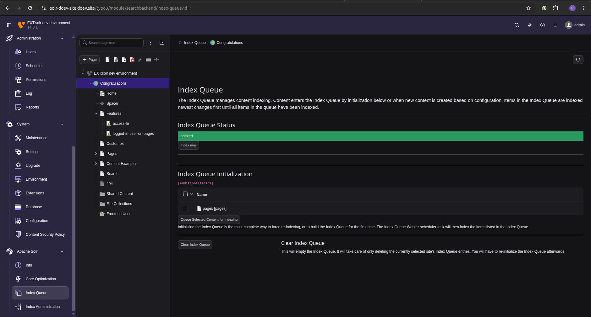
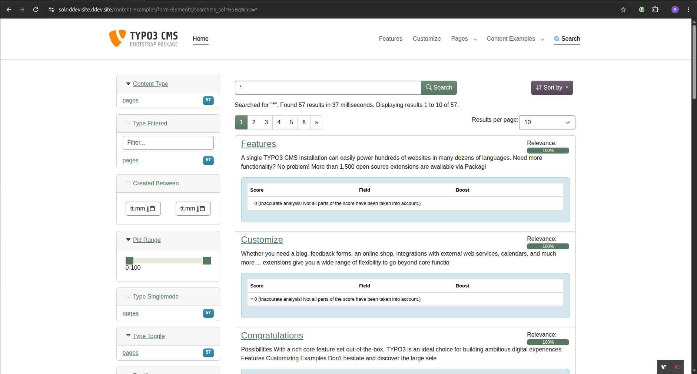

# EXT:solr Workshops — Participant Guide

This guide is for **workshop attendees** preparing to join an EXT:solr training or workshop.
For general contributor onboarding, see the main [README](../README.md).

## Before the workshop

To make sure we **don't lose time setting up the environment during the workshop**, please complete the preparations below in advance.
If anything doesn't work as expected, **contact us a few days before the event** — see [Getting help before the workshop](#getting-help-before-the-workshop).

> **Estimated total preparation time: ~30 min** (including Docker & DDEV installation).

## Required prior knowledge

The workshops assume working knowledge of:

- **TYPO3 CMS** — backend usage, extensions, site configuration
- **TypoScript** — basic configuration syntax
- **Fluid templating** — variables, sections, partials, ViewHelpers

If any of these are new to you, please refresh them via [docs.typo3.org](https://docs.typo3.org/) before the event.

### New to DDEV?

DDEV has become the **de-facto standard** for local TYPO3 development environments. If you've never used it before, please:

1. Read the official TYPO3 guide: [Install TYPO3 with DDEV](https://docs.typo3.org/m/typo3/tutorial-getting-started/main/en-us/Installation/Install.html#installation-ddev-tutorial).
2. Browse the [DDEV documentation](https://ddev.readthedocs.io/) — at least the [Quickstart](https://ddev.readthedocs.io/en/stable/users/quickstart/) and [CLI usage](https://ddev.readthedocs.io/en/stable/users/usage/cli/) sections.
3. Play around with this project after `ddev start` — try `ddev ssh`, `ddev describe`, `ddev logs`, `ddev restart`, etc. to get comfortable with the workflow.

## Accounts & access

- **TYPO3 Slack** — we use a TYPO3 Slack channel during the workshop.
  Get an invite via the [TYPO3 Slack sign-up](https://my.typo3.org/about-mytypo3org/slack/),
  then contact @dkd-kaehm or @dkd-friedrich join the private Workshop channel.
- **GitHub** — recommended for exercises that involve cloning forks or filing issues.

## Environment setup

Follow the main [README — Prerequisites & Quick Start](../README.md#prerequisites) to install Docker, DDEV, and start the project.

After `ddev start`, run `ddev describe` to see your project URLs. The DDEV hostname differs per branch (e.g. `solr-ddev-site.ddev.site` on `main`, `solr-13.1.ddev.site` on `release-13.1.x`). Verify you can reach:

- **TYPO3 Frontend**: the listed `https://<project-name>.ddev.site` URL
- **TYPO3 Backend**: `https://<project-name>.ddev.site/typo3/` (`admin` / `Password1!`)
- **Solr Admin UI**: `https://<project-name>.ddev.site:8983/`

### Verify indexing & search work

Once a few pages have been indexed, open the **Index Queue** module in the TYPO3 backend:

`https://<project-name>.ddev.site/typo3/module/searchbackend/index-queue?id=1`

The progress bar must be **green** (all items processed without errors):

Then open the frontend search page and run a query — you **must** receive search results back:

If the progress bar is red/yellow or no results appear, something is wrong with your environment.

If any of these checks fail, reach out **before the event** — see below.

### Verify IDE access to the project

Open the project root in your IDE and make sure:

- **You can read all files** in the project, including `vendor/`, `packages/`, and `public/` (no permission errors when navigating the tree).
- **You can edit files in `packages/apache_solr_for_typo3_sitepackage/`** — during the workshop you will modify Fluid templates, TypoScript, and configuration in this site package. Try saving a trivial change and reverting it to confirm write access works.

If your IDE shows permission errors (e.g. files appear read-only or saving fails), fix the ownership/permissions on your host **before the event**.

## Getting help before the workshop

If your environment is not ready by the day of the event:

- **TYPO3 Slack**: ping `@dkd-kaehm` or `@dkd-friedrich` in TYPO3 Slack
- **Email**: [solr-eb-support@dkd.de](mailto:solr-eb-support@dkd.de)

We can help you debug your local setup, but only if you reach out in time.

## Useful references for the workshop

- [Project Structure & Docker Services](ProjectStructure.md) — what runs where, Solr admin UI views
- [EXT:solr Backend Modules](BackendModules.md) — the modules you'll work with in the TYPO3 backend
- [Addons & Demo Features](Addons.md) — how to enable optional EXT:solr extensions for exercises
